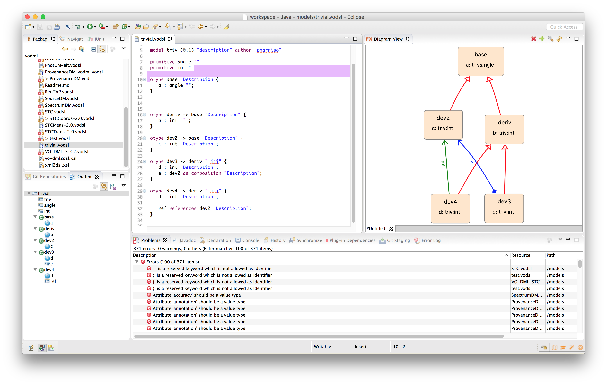

A DSL for VODML
===============

This directory contains a proposal (still a work in progress) for a domain specific language serialization 
for the [VODML](http://www.ivoa.net/documents/VODML) called VODSL. 
The aims of the serialization are

 - have something easier than XML to edit
 - more constrained and specific than UML
 - focused editors via eclipse [Xtext](https://eclipse.org/Xtext) with simultaneous graphical visualization via [FXDiagram](http://jankoehnlein.github.io/FXDiagram/) 
 
 
 
 Some background information and demonstration of how to use the editor can be found in [this presentation](VODSL_VODML_PAH.pdf).  
 and there is a [screencast](https://youtu.be/xzSk413raLY) showing installation and simple use of the editor. (note that the installation has now changed - see below)
 
In addition to be able to use some of the features of the graphical visualization via [FXDiagram](http://jankoehnlein.github.io/FXDiagram/) it is worth looking at the introductory video on that site.

Installation of Pre-built Editor
--------------------------------

The [VODSLEditor.setup](./VODSLEditor.setup) file can be read into the eclipse installer in advanced mode as a user product to create a minimal customized eclipse installation that just contains the vodsl editor.

1. ensure that you have a Java 11 or later installed on your machine as well as [graphviz](https://graphviz.org)
2. download the eclipse installer https://www.eclipse.org/downloads/
3. Run the eclipse installer and select "advanced mode" from the menu at top right.
4. use the green arrow at the top right to add a new user product with the following url https://raw.githubusercontent.com/pahjbo/vodsl/master/VODSLEditor.setup
5. select the "VODSL" user product and just click next through the dialogs until you have a running editor.
6. create a new "general" project and then create a file with extension `.vodsl` - eclipse will prompt whether to convert the project to "XText" - say yes.

Once you have an editor then you can also explore [this GitHub project](https://github.com/ivoa/vodsl-models) which contains some example/standard models expressed in VODSL.
 

   
Using the stand-alone parser
-------------------------------

It is possible to use the parser machinery in a stand-alone fashion (i.e. without 
having to work in eclipse) by using the jar file that is produced in the `vodsl.standalone`
sub-directory.

This jar (only) is published to maven central so you do not to have to build it.

Use the following command to run the parser

    java -jar vodslparser-0.4.2.jar model.vodsl

which will produce a file `model.vo-dml.xml` of the equivalent VO-DML.

The stand-alone parser is built using [maven](http://maven.apache.org). All that is necessary 
(after building the editor plugins in the top level directory with mvn install)
is to run 

    mvn install
    
in the `vodsl.standalone/` directory and a jar file will be produced in `target/`

Developing
----------
   
If you want to develop vodsl itself then see the [developer instructions](./Developing.md).
